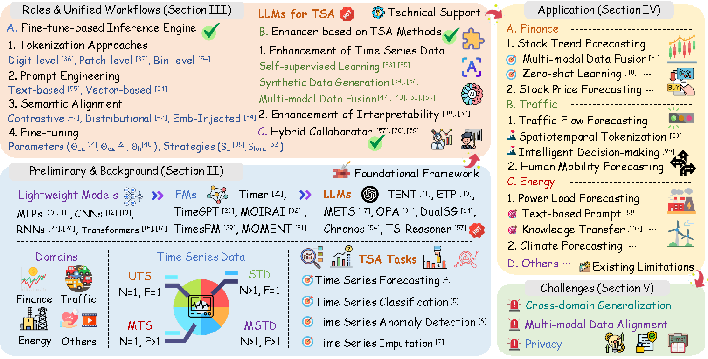
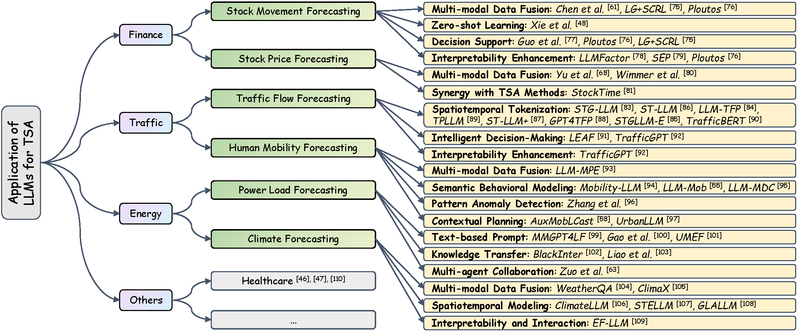

[](https://github.com/TongjiFinLab/awesome-financial-time-series-forecasting)
<div align="center">

# 🚀 Awesome Time Series Analysis <!-- omit in toc -->

**📈 A Comprehensive Collection of Papers, Codes & Resources for Time Series Analysis**

[](https://github.com/TongjiFinLab/awesome-time-series-forecasting)
[](https://github.com/TongjiFinLab/awesome-time-series-forecasting)
[](https://github.com/TongjiFinLab/awesome-time-series-forecasting/graphs/commit-activity)

</div>

---

🔥 This project collects and organizes **high-quality papers and codes** for **Time Series Analysis (TSA)**, featuring the latest advances in *LLMs*, *Foundation Models*, *Graph Neural Networks*, and more!

### ✨ **Key Features**
- 🎯 **Comprehensive Coverage**: Forecasting, Classification, Imputation, Anomaly Detection
- 🏢 **Multi-domain Applications**: Finance, Healthcare, Energy, Transportation
- 📊 **Systematic Organization**: Well-structured taxonomy and unified workflows
- 🔄 **Regular Updates**: Keep up with the latest research developments

**🔥 Collaboration:**  
If you notice any missing content or would like to contribute, please feel free to reach out!

> ✨ **Recent Update (April 5, 2026)**
>
> We have added **~40 new papers** covering the latest advances from **ICLR 2026, ICML 2025, NeurIPS 2025, KDD 2025/2026, AAAI 2026, IJCAI 2025**, and more. Key additions include:
> - New LLM-based methods: SE-LLM (ICLR 2026), FreqLLM (IJCAI 2025)
> - Foundation models: Chronos-2, Moirai 2.0, Aurora (ICLR 2026), TimeDiT (KDD 2025), TimeHF, Toto
> - New Transformer architectures: DUET (KDD 2025), TFPS (NeurIPS 2025), TimeDistill (KDD 2026)
> - Vision-Language models for TS: VLM4TS (AAAI 2026 Oral), OccamVTS (AAAI 2026)
> - Multiple new surveys and benchmarks
>
> ---
>
> <details>
> <summary>📜 <strong>Previous Update (October 17, 2025)</strong></summary>
>
> 💎 **1. Our work was accepted by TKDE**
>
> We are excited to announce that our paper ***"Financial Time Series Prediction With Multi-Granularity Graph Augmented Learning"*** has been accepted for publication in **IEEE Transactions on Knowledge and Data Engineering (TKDE)** !
> 
> 💎 **2. New Survey Released**
>
> We are excited to announce our latest survey: ***"Large Language Models for Time Series Analysis: Methodologies, Applications, and Emerging Challenges"***.
>
> > 📄 **The PDF version of this paper can be found in the `papers/` directory of this project**
>
> This survey highlights these key contributions:
>
> - **Roles-Based Taxonomy & Unified Workflows**  
  We systematically categorize the roles assumed by LLMs in TSA and abstract unified workflows for each role, clarifying their core functionalities and diverse contributions to the field.
> 
> - **Mechanism-Centric Analysis of Applications**  
  We comprehensively review representative applications across multiple domains and categorize these applications based on the distinct mechanisms through which LLMs enhance domain-specific tasks, offering new perspectives and insights for the advancement of these downstream tasks.
> 
> - **Limitations & Future Directions**  
  We critically examine the key limitations and open challenges in deploying LLMs for TSA and propose prospective research directions to address these challenges and advance the field.
>
> 💎 **3. Project Structure Update**
>
> We have restructured this repository for improved clarity and usability:
> - **Section A: Large Language Models** — Dedicated to resources and research related to LLMs for TSA.
> - **Section B: Foundation Models** — Focused on foundation models for TSA.
> 
>
> 💎 **4. Literature Update**
>
> We have updated the literature collection, adding several outstanding and recent papers to further enrich the repository.
>
> </details>

If you find this project helpful, please don't forget to give it a ⭐ Star to show your support. Thank you!

## Contents <!-- omit in toc -->

- [A. Large Language Models](#a-large-language-models)
  - [Taxonomy of Roles and Unified Workflows](#taxonomy-of-roles-and-unified-workflows)
    - [Role 1️: Fine-tune-based Inference Engines](#role-1️-fine-tune-based-inference-engines)
    - [Role 2️: Enhancer based on TSA Methods](#role-2️-enhancer-based-on-tsa-methods)
    - [Role 3️: Hybrid Collaborators](#role-3️-hybrid-collaborators)
  - [Application](#application)
    - [Finance](#finance)
    - [Traffic](#traffic)
    - [Energy](#energy)
    - [Others](#others)
- [B. Foundation Models](#b-foundation-models)
- [C. Graph Neural Network-based Models](#c-graph-neural-network-based-models)
- [D. Reinforcement Learning-based Models](#d-reinforcement-learning-based-models)
- [E. Transformer-based Models](#e-transformer-based-models)
- [F. Generative Methods based Models](#f-generative-methods-based-models)
- [G. Classical Time Series Models](#g-classical-time-series-models)
- [H. Quantitative Open Sourced Framework](#h-quantitative-open-sourced-framework)
- [I. Alpha Factor Mining](#i-alpha-factor-mining)
- [J. Survey](#j-survey)
- [📚 **Citation**](#-citation)
  - [👥 **Contributors**](#-contributors)
  - [📄 **License**](#-license)
  - [⭐ **Star History**](#-star-history)

## A. Large Language Models

<div align="center">
  
</div>
<div align="center">
  <b>Figure 1: Frameworks of our new work "Large Language Models for Time Series Analysis: Methodologies, Applications, and Emerging Challenges".</b>
</div>

### Taxonomy of Roles and Unified Workflows

<div align="center"><sub>

|**Model**|**Task**|**Role**|**Tokenization**|**Prompt**|**Semantic Alignment**|**Fine-tuning**|**Code**|
|:---:|:---:|:---:|:---:|:---:|:---:|:---:|:---:|
|**OFA**|General|IE|`Patch-level`|`Vector-based`|`Emb-Injected`|`Endogenous(Direct)`|[✅](https://github.com/DAMO-DI-ML/NeurIPS2023-One-Fits-All)|
|**aLLM4TS**|Forecasting|IE|`Patch-level`|`Vector-based`|-|`Hybrid(Direct)`|[✅](https://github.com/yxbian23/aLLM4TS)|
|**PromptCast**|Forecasting|IE|`Digit-level`|`Text-based`|-|-|[✅](https://github.com/haoxue2/PromptCast)|
|**TimeLLM**|Forecasting|IE|`Patch-level`|`Vector-based`|`Emb-Injected`|`Exogenous(Direct)`|[✅](https://github.com/KimMeen/Time-LLM)|
|**UniTime**|Forecasting|IE|`Patch-level`|`Vector-based`|`Emb-Injected`|`Exogenous(Direct)`|[✅](https://github.com/liuxu77/UniTime)|
|**AutoTimes**|Forecasting|IE|`Patch-level`|`Vector-based`|-|`Hybrid(Direct)`|[✅](https://github.com/thuml/AutoTimes)|
|**S2IP-LLM**|Forecasting|IE|`Patch-level`|`Vector-based`|`Distributional`|`Exogenous(Direct)`|[✅](https://github.com/panzijie825/S2IP-LLM)|
|**ETP**|Classification|IE|-|`Vector-based`|`Contrastive`|`Exogenous(Direct)`|❌|
|**TENT**|Classification|IE|-|`Vector-based`|`Contrastive`|`Exogenous(Direct)`|❌|
|**Qiu et al.**|Classification|IE|-|`Vector-based`|`Distributional`|-|❌|
|**MTAM**|Classification|IE|`Patch-level`|-|`Distributional`|-|❌|
|**TimeCMA**|Forecasting|IE|`Digit-level`|`Text-based`|`Distributional`|`Exogenous(Direct)`|[✅](https://github.com/ChenxiLiu-HNU/TimeCMA)|
|**TableTime**|Classification|IE|`Digit-level`|`Text-based`|`Distributional`|`Exogenous(Direct)`|[✅](https://github.com/ChenxiLiu-HNU/TableTime)|
|**MedualTime**|Classification|IE|`Digit-level`|`Text-based`|`Emb-Injected`|`Exogenous(Direct)`|[✅](https://github.com/start2020/MedualTime)|
|**METS**|Classification|E|-|-|`Contrastive`|-|✅|
|**Xie et al.**|Forecasting|E|-|`Text-based`|-|`Multi-modal Fusion`|❌|
|**TimeReasoner**|Forecasting|E|-|`Text-based`|-|-|❌|
|**Time-R1**|Forecasting|E|-|`Text-based`|-|-|❌|
|**Time-RA**|Anomaly Detection|E|-|-|-|-|✅|
|**TEMPO**|Forecasting|IE+E|`Patch-level`|`Vector-based`|`Emb-Injected`|`Hybrid(LoRA)`|[✅](https://github.com/DC-research/TEMPO)|
|**LLM4TS**|Forecasting|IE+E|`Patch-level`|`Vector-based`|-|`Endogenous(LoRA)`|[✅](https://github.com/blacksnail789521/LLM4TS)|
|**TEST**|General|IE+E|`Patch-level`|`Vector-based`|`Contrastive`|`Exogenous(Direct)`|✅|
|**Chronos**|General|IE+E|`Bin-level`|`Vector-based`|-|`Exogenous(Direct)`|[✅](https://github.com/amazon-science/chronos-forecasting)|
|**LLM-Mob**|Forecasting|IE+E|`Digit-level`|`Text-based`|-|-|[✅](https://github.com/xlwang233/LLM-Mob)|
|**TimeCAP**|Forecasting|IE+E|-|`Text-based`|-|`Exogenous(Direct)`|[✅](https://github.com/geon0325/TimeCAP)|
|**TS-Reasoner**|Forecasting|HC|-|`Text-based`|-|-|❌|
|**AuxMobLCast**|Forecasting|HC|`Digit-level`|`Vector-based`|-|-|❌|
|**LAMP**|Forecasting|HC|-|`Text-based`|-|-|❌|
|**LA-GCN**|Forecasting|HC|`Digit-level`|`Text-based`|-|-|❌|
|**Chen et al.**|Forecasting|HC|-|`Text-based`|-|-|❌|
|**Park et al.**|Anomaly Detection|HC|-|`Text-based`|-|-|❌|
|**Zuo et al.**|Forecasting|HC|-|`Text-based`|-|-|❌|
|**DualSG**|Forecasting|HC|-|`Text-based`|-|`Exogenous(Direct)`|[✅](https://github.com/BenchCouncil/DualSG)|
|**SE-LLM**|Forecasting|IE|`Patch-level`|`Vector-based`|`Emb-Injected`|`Exogenous(Direct)`|❌|
|**FreqLLM**|Forecasting|IE|`Patch-level`|`Vector-based`|`Distributional`|`Exogenous(Direct)`|[✅](https://github.com/biya0105/FreqLLM)|
|**LLM-TPF**|Forecasting|IE|`Patch-level`|`Vector-based`|`Distributional`|`Exogenous(Direct)`|❌|
|**LLM4FTS**|Forecasting|IE+E|`Patch-level`|`Text-based`|-|`Exogenous(Direct)`|❌|
|**VLM4TS**|Anomaly Detection|E|-|`Text-based`|-|-|[✅](https://github.com/ZLHe0/VLM4TS)|
|**OccamVTS**|Forecasting|E|-|-|-|`Exogenous(Direct)`|❌|

</sub></div>


<sub>***Note**: **IE** stands for Inference Engine, **E** stands for Enhancer, **IE+E** stands for the combination of Inference Engine and Enhancer, and **HC** stands for Hybrid Collaborator.*</sub>


#### Role 1️: Fine-tune-based Inference Engines 

##### Tokenization Approaches <!-- omit in toc -->

###### Digit-level Tokenization <!-- omit in toc -->

- **Llama 2: Open Foundation and Fine-Tuned Chat Models**  
  Hugo Touvron, Thibaut Lavril, Gautier Izacard, Xavier Martinet, Marie-Anne Lachaux, Timothée Lacroix, Baptiste Rozière, Naman Goyal, Eric Hambro, Faisal Azhar, Aurelien Rodriguez, Armand Joulin, Edouard Grave, Guillaume Lample  
  arXiv, 2023.  
  [Paper](https://arxiv.org/pdf/2307.09288)

- **MedualTime: A Dual-Adapter Language Model for Medical Time Series-Text Multimodal Learning**  
  Ye, Jiexia and Zhang, Weiqi and Li, Ziyue and Li, Jia and Zhao, Meng and Tsung, Fugee  
  arXiv, 2024.  
  [Paper](https://arxiv.org/abs/2406.06620) | [Code](https://github.com/start2020/MedualTime)


- **PromptCast: A New Prompt-based Learning Paradigm for Time Series Forecasting**  
  Hao Xue, Flora D Salim  
  IEEE TKDE, 2023.  
  [Paper](https://ieeexplore.ieee.org/document/10123956) | [Code](https://github.com/haoxue2/PromptCast)


###### Patch-level Tokenization <!-- omit in toc -->

- **One fits all: Power general time series analysis by pretrained LM**  
  Tian Zhou, Peisong Niu, Liang Sun, Rong Jin, et al.  
  NeurIPS 2023.  
  [Paper](https://proceedings.neurips.cc/paper_files/paper/2023/file/86c17de05579cde52025f9984e6e2ebb-Paper-Conference.pdf) | [Code](https://github.com/DAMO-DI-ML/NeurIPS2023-One-Fits-All)

- **Multi-patch prediction: Adapting language models for time series representation learning**  
  Yuxuan Bian, Xuan Ju, Jiangtong Li, Zhijian Xu, Dawei Cheng, Qiang Xu  
  ICML 2024.  
  [Paper](https://openreview.net/pdf?id=Rx9GMufByc) | [Code](https://github.com/yxbian23/aLLM4TS)

- **Time-LLM: Time Series Forecasting by Reprogramming Large Language Models**  
  Ming Jin, Shiyu Wang, Lintao Ma, Zhixuan Chu, James Y. Zhang, Xiaoming Shi, Pin-Yu Chen, Yuxuan Liang, Yuan-Fang Li, Shirui Pan, Qingsong Wen  
  ICLR 2024.  
  [Paper](https://openreview.net/pdf?id=Unb5CVPtae) | [Code](https://github.com/KimMeen/Time-LLM)

- **UniTime: A language-empowered unified model for cross-domain time series forecasting**  
  Xu Liu, Junfeng Hu, Yuan Li, Shizhe Diao, Yuxuan Liang, Bryan Hooi, Roger Zimmermann  
  WWW 2024.  
  [Paper](https://dl.acm.org/doi/pdf/10.1145/3589334.3645434) | [Code](https://github.com/liuxu77/UniTime)

- **SE-LLM: Semantic-Enhanced Time-Series Forecasting via Large Language Models**  
  ICLR 2026.  
  [Paper](https://arxiv.org/abs/2508.07697)

- **FreqLLM: Frequency-Aware Large Language Models for Time Series Forecasting**  
  Shunnan Wang et al.  
  IJCAI 2025.  
  [Paper](https://www.ijcai.org/proceedings/2025/377) | [Code](https://github.com/biya0105/FreqLLM)

- **LLM-TPF: Multiscale Temporal Periodicity-Semantic Fusion LLMs for Time Series Forecasting**  
  Qihong Pan et al.  
  IJCAI 2025.  
  [Paper](https://www.ijcai.org/proceedings/2025/671)

###### Bin-level Tokenization <!-- omit in toc -->

- **Chronos: Learning the Language of Time Series**  
  Abdul Fatir Ansari, Lorenzo Stella, Ali Caner Turkmen, Xiyuan Zhang, Pedro Mercado, Huibin Shen, Oleksandr Shchur, Syama Sundar Rangapuram, Sebastian Pineda Arango, Shubham Kapoor, Jasper Zschiegner, Danielle C. Maddix, Hao Wang, Michael W. Mahoney, Kari Torkkola, Andrew Gordon Wilson, Michael Bohlke-Schneider, Bernie Wang  
  TMLR 2024.  
  [Paper](https://openreview.net/pdf?id=gerNCVqqtR) | [Code](https://github.com/amazon-science/chronos-forecasting)

##### Prompt Engineering <!-- omit in toc -->

###### Text-based Prompt <!-- omit in toc -->

- **PromptCast: A New Prompt-based Learning Paradigm for Time Series Forecasting**  
  Hao Xue, Flora D Salim  
  IEEE TKDE, 2023.  
  [Paper](https://ieeexplore.ieee.org/document/10123956) | [Code](https://github.com/haoxue2/PromptCast)

- **Leveraging language foundation models for human mobility forecasting**  
  Hao Xue, Bhanu Prakash Voutharoja, Flora D Salim  
  SIGSPATIAL 2022.  
  [Paper](https://dl.acm.org/doi/pdf/10.1145/3557915.3561026)

- **Where would I go next? Large language models as human mobility predictors**  
  Xinglei Wang, Meng Fang, Zichao Zeng, Tao Cheng  
  arXiv 2023.  
  [Paper](https://arxiv.org/abs/2308.15197) | [Code](https://github.com/xlwang233/LLM-Mob)

- **LST-Prompt: Large Language Models as Zero-Shot Time Series Forecasters by Long-Short-Term Prompting**  
  Haoxin Liu, Zhiyuan Zhao, Jindong Wang, Harshavardhan Kamarthi, B Aditya Prakash  
  ACL 2024.  
  [Paper](https://aclanthology.org/2024.findings-acl.466.pdf) | [Code](https://github.com/AdityaLab/lstprompt)

- **TableTime: Reformulating Time Series Classification as Training-Free Table Understanding with Large Language Models**  
  Jiahao Wang, Mingyue Cheng, Qingyang Mao, Yitong Zhou, Feiyang Xu, Xin Li  
  arXiv 2024.  
  [Paper](https://arxiv.org/abs/2411.15737)

- **The Wall Street Neophyte: A Zero-Shot Analysis of ChatGPT Over MultiModal Stock Movement Prediction Challenges**  
  Qianqian Xie, Weiguang Han, Yanzhao Lai, Min Peng, Jimin Huang  
  arXiv 2023.  
  [Paper](https://arxiv.org/pdf/2304.05351)

- **Rethinking the Role of LLMs in Time Series Forecasting**  
  Xin Qiu et al.  
  arXiv 2026.  
  [Paper](https://arxiv.org/abs/2602.14744)

###### Vector-based (Soft) Prompt <!-- omit in toc -->

- **One fits all: Power general time series analysis by pretrained LM**  
  Tian Zhou, Peisong Niu, Liang Sun, Rong Jin, et al.  
  NeurIPS 2023.  
  [Paper](https://proceedings.neurips.cc/paper_files/paper/2023/file/86c17de05579cde52025f9984e6e2ebb-Paper-Conference.pdf) | [Code](https://github.com/DAMO-DI-ML/NeurIPS2023-One-Fits-All)

- **TEST: Text Prototype Aligned Embedding to Activate LLM's Ability for Time Series**  
  Chenxi Sun, Hongyan Li, Yaliang Li, Shenda Hong  
  ICLR 2024.  
  [Paper](https://openreview.net/pdf?id=Tuh4nZVb0g)


- **TEMPO: Prompt-based Generative Pre-trained Transformer for Time Series Forecasting**  
  Defu Cao, Furong Jia, Sercan Ö. Arik, Tomas Pfister, Yixiang Zheng, Wen Ye, Yan Liu  
  ICLR 2024.  
  [Paper](https://arxiv.org/abs/2310.04948) | [Code](https://github.com/DC-research/TEMPO)

- **S²IP-LLM: Semantic space informed prompt learning with LLM for time series forecasting**  
  Zijie Pan, Yushan Jiang, Sahil Garg, Anderson Schneider, Yuriy Nevmyvaka, Dongjin Song  
  ICML 2024.  
  [Paper](https://openreview.net/pdf?id=qwQVV5R8Y7) | [Code](https://github.com/panzijie825/S2IP-LLM)

- **Time-LLM: Time Series Forecasting by Reprogramming Large Language Models**  
  Ming Jin, Shiyu Wang, Lintao Ma, Zhixuan Chu, James Y. Zhang, Xiaoming Shi, Pin-Yu Chen, Yuxuan Liang, Yuan-Fang Li, Shirui Pan, Qingsong Wen  
  ICLR 2024.  
  [Paper](https://openreview.net/pdf?id=Unb5CVPtae) | [Code](https://github.com/KimMeen/Time-LLM)

- **AutoTimes: Autoregressive time series forecasters via large language models**  
  Yong Liu, Guo Qin, Xiangdong Huang, Jianmin Wang, Mingsheng Long  
  NeurIPS 2024.  
  [Paper](https://proceedings.neurips.cc/paper_files/paper/2024/file/dcf88cbc8d01ce7309b83d0ebaeb9d29-Paper-Conference.pdf) | [Code](https://github.com/thuml/AutoTimes)

- **Domain-Oriented Time Series Inference Agents for Reasoning and Automated Analysis**  
  Wen Ye, Wei Yang, Defu Cao, Yizhou Zhang, Lumingyuan Tang, Jie Cai, Yan Liu  
  arXiv 2024.  
  [Paper](https://arxiv.org/abs/2410.04047)

##### Semantic Alignment <!-- omit in toc -->

###### Contrastive Alignment <!-- omit in toc -->

- **ETP: Learning transferable ECG representations via ECG-text pre-training**  
  Che Liu, Zhongwei Wan, Sibo Cheng, Mi Zhang, Rossella Arcucci  
  ICASSP 2024.  
  [Paper](https://ieeexplore.ieee.org/stamp/stamp.jsp?tp=&arnumber=10446742)

- **TimeCMA: Towards LLM-empowered multivariate time series forecasting via cross-modality alignment**  
  Chenxi Liu, Qianxiong Xu, Hao Miao, Sun Yang, Lingzheng Zhang, Cheng Long, Ziyue Li, Rui Zhao  
  AAAI 2025.  
  [Paper](https://ojs.aaai.org/index.php/AAAI/article/view/34067/36222) | [Code](https://github.com/ChenxiLiu-HNU/TimeCMA)

- **Can brain signals reveal inner alignment with human languages?**  
  Jielin Qiu, William Han, Jiacheng Zhu, Mengdi Xu, Douglas Weber, Bo Li, Ding Zhao  
  EMNLP 2023.  
  [Paper](https://aclanthology.org/2023.findings-emnlp.120.pdf) | [Code](https://github.com/Jielin-Qiu/EEG_Language_Alignment)

###### Distributional Alignment <!-- omit in toc -->

- **Transfer knowledge from natural language to electrocardiography: Can we detect cardiovascular disease through language models?**  
  Jielin Qiu, William Han, Jiacheng Zhu, Mengdi Xu, Michael Rosenberg, Emerson Liu, Douglas Weber, Ding Zhao  
  arXiv 2023.  
  [Paper](https://arxiv.org/abs/2301.09017) | [Code](https://github.com/Jielin-Qiu/Transfer_Knowledge_from_Language_to_ECG)

- **S²IP-LLM: Semantic space informed prompt learning with LLM for time series forecasting**  
  Zijie Pan, Yushan Jiang, Sahil Garg, Anderson Schneider, Yuriy Nevmyvaka, Dongjin Song  
  ICML 2024.  
  [Paper](https://openreview.net/pdf?id=qwQVV5R8Y7) | [Code](https://github.com/panzijie825/S2IP-LLM)

###### Embedding-Injected Alignment <!-- omit in toc -->

- **Time-LLM: Time Series Forecasting by Reprogramming Large Language Models**  
  Ming Jin, Shiyu Wang, Lintao Ma, Zhixuan Chu, James Y. Zhang, Xiaoming Shi, Pin-Yu Chen, Yuxuan Liang, Yuan-Fang Li, Shirui Pan, Qingsong Wen  
  ICLR 2024.  
  [Paper](https://openreview.net/pdf?id=Unb5CVPtae) | [Code](https://github.com/KimMeen/Time-LLM)

- **TEST: Text Prototype Aligned Embedding to Activate LLM's Ability for Time Series**  
  Chenxi Sun, Hongyan Li, Yaliang Li, Shenda Hong  
  ICLR 2024.  
  [Paper](https://openreview.net/pdf?id=Tuh4nZVb0g)

- **Tent: Connect language models with IoT sensors for zero-shot activity recognition**  
  Yunjiao Zhou, Jianfei Yang, Han Zou, Lihua Xie  
  arXiv 2023.  
  [Paper](https://arxiv.org/abs/2311.08245)

##### Fine-tuning <!-- omit in toc -->

###### Parameters Selection <!-- omit in toc -->

###### Endogenous Parameters <!-- omit in toc -->

- **Time-LLM: Time Series Forecasting by Reprogramming Large Language Models**  
  Ming Jin, Shiyu Wang, Lintao Ma, Zhixuan Chu, James Y. Zhang, Xiaoming Shi, Pin-Yu Chen, Yuxuan Liang, Yuan-Fang Li, Shirui Pan, Qingsong Wen  
  ICLR 2024.  
  [Paper](https://openreview.net/pdf?id=Unb5CVPtae) | [Code](https://github.com/KimMeen/Time-LLM)

- **Multi-patch prediction: Adapting language models for time series representation learning**  
  Yuxuan Bian, Xuan Ju, Jiangtong Li, Zhijian Xu, Dawei Cheng, Qiang Xu  
  ICML 2024.  
  [Paper](https://openreview.net/pdf?id=Rx9GMufByc) | [Code](https://github.com/yxbian23/aLLM4TS)

###### Exogenous Parameters <!-- omit in toc -->

- **S²IP-LLM: Semantic space informed prompt learning with LLM for time series forecasting**  
  Zijie Pan, Yushan Jiang, Sahil Garg, Anderson Schneider, Yuriy Nevmyvaka, Dongjin Song  
  ICML 2024.  
  [Paper](https://openreview.net/pdf?id=qwQVV5R8Y7) | [Code](https://github.com/panzijie825/S2IP-LLM)

- **TEST: Text Prototype Aligned Embedding to Activate LLM's Ability for Time Series**  
  Chenxi Sun, Hongyan Li, Yaliang Li, Shenda Hong  
  ICLR 2024.  
  [Paper](https://openreview.net/pdf?id=Tuh4nZVb0g)

###### Hybrid Parameters <!-- omit in toc -->

- **TimeCMA: Towards LLM-empowered multivariate time series forecasting via cross-modality alignment**  
  Chenxi Liu, Qianxiong Xu, Hao Miao, Sun Yang, Lingzheng Zhang, Cheng Long, Ziyue Li, Rui Zhao  
  AAAI 2025.  
  [Paper](https://ojs.aaai.org/index.php/AAAI/article/view/34067/36222) | [Code](https://github.com/ChenxiLiu-HNU/TimeCMA)

- **UniTime: A language-empowered unified model for cross-domain time series forecasting**  
  Xu Liu, Junfeng Hu, Yuan Li, Shizhe Diao, Yuxuan Liang, Bryan Hooi, Roger Zimmermann  
  WWW 2024.  
  [Paper](https://dl.acm.org/doi/pdf/10.1145/3589334.3645434) | [Code](https://github.com/liuxu77/UniTime)

###### Fine-tuning Strategies Selection <!-- omit in toc -->

###### Direct Fine-tuning <!-- omit in toc -->

- **Time-LLM: Time Series Forecasting by Reprogramming Large Language Models**  
  Ming Jin, Shiyu Wang, Lintao Ma, Zhixuan Chu, James Y. Zhang, Xiaoming Shi, Pin-Yu Chen, Yuxuan Liang, Yuan-Fang Li, Shirui Pan, Qingsong Wen  
  ICLR 2024.  
  [Paper](https://openreview.net/pdf?id=Unb5CVPtae) | [Code](https://github.com/KimMeen/Time-LLM)

- **A Decoder-Only Foundation Model for Time-Series Forecasting**  
  Das, Abhimanyu and Kong, Weihao and Sen, Rajat and Zhou, Yichen  
  ICML, 2024.  
  [Paper](https://openreview.net/pdf?id=jn2iTJas6h) | [Code](https://github.com/google-research/timesfm/)

- **Multi-patch prediction: Adapting language models for time series representation learning**  
  Yuxuan Bian, Xuan Ju, Jiangtong Li, Zhijian Xu, Dawei Cheng, Qiang Xu  
  ICML 2024.  
  [Paper](https://openreview.net/pdf?id=Rx9GMufByc) | [Code](https://github.com/yxbian23/aLLM4TS)

###### LoRA-based Fine-tuning <!-- omit in toc -->

- **UniTime: A language-empowered unified model for cross-domain time series forecasting**  
  Xu Liu, Junfeng Hu, Yuan Li, Shizhe Diao, Yuxuan Liang, Bryan Hooi, Roger Zimmermann  
  WWW 2024.  
  [Paper](https://dl.acm.org/doi/pdf/10.1145/3589334.3645434) | [Code](https://github.com/liuxu77/UniTime)

- **TimeCMA: Towards LLM-empowered multivariate time series forecasting via cross-modality alignment**  
  Chenxi Liu, Qianxiong Xu, Hao Miao, Sun Yang, Lingzheng Zhang, Cheng Long, Ziyue Li, Rui Zhao  
  AAAI 2025.  
  [Paper](https://ojs.aaai.org/index.php/AAAI/article/view/34067/36222) | [Code](https://github.com/ChenxiLiu-HNU/TimeCMA)

- **S²IP-LLM: Semantic space informed prompt learning with LLM for time series forecasting**  
  Zijie Pan, Yushan Jiang, Sahil Garg, Anderson Schneider, Yuriy Nevmyvaka, Dongjin Song  
  ICML 2024.  
  [Paper](https://openreview.net/pdf?id=qwQVV5R8Y7) | [Code](https://github.com/panzijie825/S2IP-LLM)

#### Role 2️: Enhancer based on TSA Methods

##### Enhancement of Time Series Data <!-- omit in toc -->

###### Self-Supervised Learning <!-- omit in toc -->

- **LLM4TS: Aligning pre-trained LLMs as data-efficient time-series forecasters**  
  Ching Chang, Wei-Yao Wang, Wen-Chih Peng, Tien-Fu Chen  
  ACM Transactions on Intelligent Systems and Technology 2025.  
  [Paper](https://dl.acm.org/doi/pdf/10.1145/3719207) | [Code](https://github.com/blacksnail789521/LLM4TS)

- **Multi-patch prediction: Adapting language models for time series representation learning**  
  Yuxuan Bian, Xuan Ju, Jiangtong Li, Zhijian Xu, Dawei Cheng, Qiang Xu  
  ICML 2024.  
  [Paper](https://openreview.net/pdf?id=Rx9GMufByc) | [Code](https://github.com/yxbian23/aLLM4TS)

###### Synthetic Data Generation <!-- omit in toc -->

- **Chronos: Learning the Language of Time Series**  
  Abdul Fatir Ansari, Lorenzo Stella, Ali Caner Turkmen, Xiyuan Zhang, Pedro Mercado, Huibin Shen, Oleksandr Shchur, Syama Sundar Rangapuram, Sebastian Pineda Arango, Shubham Kapoor, Jasper Zschiegner, Danielle C. Maddix, Hao Wang, Michael W. Mahoney, Kari Torkkola, Andrew Gordon Wilson, Michael Bohlke-Schneider, Bernie Wang  
  TMLR 2024.  
  [Paper](https://openreview.net/pdf?id=gerNCVqqtR) | [Code](https://github.com/amazon-science/chronos-forecasting)

- **TimeCAP: Learning to contextualize, augment, and predict time series events with large language model agents**  
  Geon Lee, Wenchao Yu, Kijung Shin, Wei Cheng, Haifeng Chen  
  AAAI 2025.  
  [Paper](https://ojs.aaai.org/index.php/AAAI/article/view/33989/36144) | [Code](https://github.com/geon0325/TimeCAP)

###### Multi-Modal Data Fusion <!-- omit in toc -->

- **Can ChatGPT Forecast Stock Price Movements? Return Predictability and Large Language Models**  
  Alejandro Lopez-Lira, Yuehua Tang  
  arXiv 2023. [[Paper](https://arxiv.org/abs/2304.07619)]

- **Frozen language model helps ECG zero-shot learning**  
  Jun Li, Che Liu, Sibo Cheng, Rossella Arcucci, Shenda Hong  
  MIDL, 2023.  
  [Paper](https://proceedings.mlr.press/v227/li24a/li24a.pdf)

- **TEMPO: Prompt-based Generative Pre-trained Transformer for Time Series Forecasting**  
  Defu Cao, Furong Jia, Sercan Ö. Arik, Tomas Pfister, Yixiang Zheng, Wen Ye, Yan Liu  
  ICLR 2024.  
  [Paper](https://arxiv.org/abs/2310.04948) | [Code](https://github.com/DC-research/TEMPO)

- **GPT4MTS: Prompt-based Large Language Model for Multimodal Time-series Forecasting**  
  Furong Jia, Kevin Wang, Yixiang Zheng, Defu Cao, Yan Liu  
  AAAI, 2024.  
  [Paper](https://ojs.aaai.org/index.php/AAAI/article/view/30383)

- **VLM4TS: Harnessing Vision-Language Models for Time Series Anomaly Detection**  
  Zelin He et al.  
  AAAI 2026 (Oral).  
  [Paper](https://arxiv.org/abs/2506.06836) | [Code](https://github.com/ZLHe0/VLM4TS)

- **OccamVTS: Distilling Vision Models to 1% Parameters for Time Series Forecasting**  
  AAAI 2026.  
  [Paper](https://arxiv.org/abs/2508.01727)

- **UniCast: A Unified Framework for Instance-Conditioned Multimodal Time-Series Forecasting**  
  arXiv 2025.  
  [Paper](https://arxiv.org/abs/2508.11954)

##### Enhancement of Interpretability <!-- omit in toc -->

- **Can "Slow-thinking" LLMs Make Time Series Predictions More Reliable? Enhancing LLM-based Time Series Forecasting via Chain-of-Thought Prompting**  
  Shuai Wang, Qing Li, Chenyang Shang, Yushu Chen, Zhenyu Liu, Xiang Li, Shenda Hong  
  arXiv 2025.  
  [Paper](https://arxiv.org/pdf/2505.24511) | [Code](https://github.com/realwangjiahao/TimeReasoner)

- **Time-R1: Towards Comprehensive Temporal Reasoning in LLMs**  
  Zijia Liu, Peixuan Han, Haofei Yu, Haoru Li, Jiaxuan You  
  arXiv 2025.  
  [Paper](https://arxiv.org/pdf/2505.13508)

- **Where would I go next? Large language models as human mobility predictors**  
  Xinglei Wang, Meng Fang, Zichao Zeng, Tao Cheng  
  arXiv 2023.  
  [Paper](https://arxiv.org/abs/2308.15197) | [Code](https://github.com/xlwang233/LLM-Mob)

- **Time-RA: Towards Time Series Reasoning for Anomaly with LLM Feedback**  
  Yiyuan Yang, Zichuan Liu, Lei Song, Kai Ying, Zhiguang Wang, Tom Bamford, Svitlana Vyetrenko, Jiang Bian, Qingsong Wen  
  arXiv 2025.  
  [Paper](https://arxiv.org/pdf/2507.15066?)

#### Role 3️: Hybrid Collaborators

- **Domain-Oriented Time Series Inference Agents for Reasoning and Automated Analysis**  
  Wen Ye, Wei Yang, Defu Cao, Yizhou Zhang, Lumingyuan Tang, Jie Cai, Yan Liu  
  arXiv 2024.  
  [Paper](https://arxiv.org/abs/2410.04047)

- **Language models can improve event prediction by few-shot abductive reasoning**  
  Xiaoming Shi, Siqiao Xue, Kangrui Wang, Fan Zhou, James Zhang, Jun Zhou, Chenhao Tan, Hongyuan Mei  
  NeurIPS 2023.  
  [Paper](https://proceedings.neurips.cc/paper_files/paper/2023/file/5e5fd18f863cbe6d8ae392a93fd271c9-Paper-Conference.pdf)

- **Leveraging language foundation models for human mobility forecasting**  
  Hao Xue, Bhanu Prakash Voutharoja, Flora D Salim  
  SIGSPATIAL 2022.  
  [Paper](https://dl.acm.org/doi/pdf/10.1145/3557915.3561026)

- **ChatGPT Informed Graph Neural Network for Stock Movement Prediction**  
  Zihan Chen, Lei Nico Zheng, Cheng Lu, Jialu Yuan, Di Zhu  
  arXiv 2023.  
  [Paper](https://arxiv.org/abs/2306.03763) | [Code](https://github.com/ZihanChen1995/ChatGPT-GNN-StockPredict)

- **Language knowledge-assisted representation learning for skeleton-based action recognition**  
  Haojun Xu, Yan Gao, Zheng Hui, Jie Li, Xinbo Gao  
  IEEE Transactions on Multimedia 2025.  
  [Paper](https://ieeexplore.ieee.org/stamp/stamp.jsp?tp=&arnumber=10891636)

- **DualSG: A Dual-Stream Explicit Semantic-Guided Multivariate Time Series Forecasting Framework**  
  Kuiye Ding, Fanda Fan, Yao Wang, Xiaorui Wang, Luqi Gong, Yishan Jiang, others  
  arXiv 2025.  
  [Paper](https://arxiv.org/pdf/2507.21830) | [Code](https://github.com/BenchCouncil/DualSG)

- **Enhancing Anomaly Detection in Financial Markets with an LLM-based Multi-Agent Framework**  
  Taejin Park  
  arXiv 2024.  
  [Paper](https://arxiv.org/abs/2403.19735)

- **Large Language Model-Empowered Interactive Load Forecasting**  
  Yu Zuo, Dalin Qin, Yi Wang  
  arXiv 2025.  
  [Paper](https://arxiv.org/pdf/2505.16577?)

### Application

<div align="center">
  
</div>

<div align="center">
  <b>Figure 2: An overview of the application of LLMs for TSA.</b>
</div>

#### Finance

##### Stock Movement (Trend) Forecasting <!-- omit in toc -->

- **ChatGPT Informed Graph Neural Network for Stock Movement Prediction**  
  Zihan Chen, Lei Nico Zheng, Cheng Lu, Jialu Yuan, Di Zhu  
  arXiv 2023.  
  [Paper](https://arxiv.org/abs/2306.03763) | [Code](https://github.com/ZihanChen1995/ChatGPT-GNN-StockPredict)

- **Integrating Stock Features and Global Information via Large Language Models for Enhanced Stock Return Prediction**  
  Yujie Ding, Shuai Jia, Tianyi Ma, Bingcheng Mao, Xiuze Zhou, Liuliu Li, Dongming Han  
  arXiv 2023.  
  [Paper](https://arxiv.org/abs/2310.05627)

- **Ploutos: Towards Interpretable Stock Movement Prediction with Financial Large Language Model**  
  Hanshuang Tong, Jun Li, Ning Wu, Ming Gong, Dongmei Zhang, Qi Zhang
  arXiv 2024.  
  [Paper](https://arxiv.org/abs/2403.00782)

- **Can ChatGPT Forecast Stock Price Movements? Return Predictability and Large Language Models**  
  Alejandro Lopez-Lira, Yuehua Tang  
  arXiv 2023.  
  [Paper](https://arxiv.org/abs/2304.07619)

- **The Wall Street Neophyte: A Zero-Shot Analysis of ChatGPT Over MultiModal Stock Movement Prediction Challenges**  
  Qianqian Xie, Weiguang Han, Yanzhao Lai, Min Peng, Jimin Huang  
  arXiv 2023.  
  [Paper](https://arxiv.org/pdf/2304.05351)

- **LLMFactor: Extracting Profitable Factors through Prompts for Explainable Stock Movement Prediction**  
  Meiyun Wang, Kiyoshi Izumi, Hiroki Sakaji  
  ACL 2024.  
  [Paper](https://aclanthology.org/2024.findings-acl.185.pdf)

- **Learning to generate explainable stock predictions using self-reflective large language models**  
  Kelvin JL Koa, Yunshan Ma, Ritchie Ng, Tat-Seng Chua
  ACM Web Conference 2024.  
  [Paper](https://dl.acm.org/doi/pdf/10.1145/3589334.3645611) | [Code](https://github.com/koa-fin/sep)
  
- **Fine-Tuning Large Language Models for Stock Return Prediction Using Newsflow**  
  Tian Guo, Emmanuel Hauptmann
  arXiv 2024.  
  [Paper](https://arxiv.org/pdf/2407.18103?)

##### Stock Price Forecasting  <!-- omit in toc -->

- **Temporal Data Meets LLM -- Explainable Financial Time Series Forecasting**  
  Xinli Yu, Zheng Chen, Yuan Ling, Shujing Dong, Zongyi Liu, Yanbin Lu  
  EMNLP 2023.  
  [Paper](https://aclanthology.org/2023.emnlp-main.193.pdf)

- **Leveraging Vision-Language Models for Granular Market Change Prediction**  
  Christopher Wimmer, Navid Rekabsaz  
  arXiv 2023.  
  [Paper](https://arxiv.org/pdf/2301.10166)

- **StockTime: A Time Series Specialized Large Language Model Architecture for Stock Price Prediction**  
  Shengkun Wang, Taoran Ji, Linhan Wang, Yanshen Sun, Shang-Ching Liu, Amit Kumar, Chang-Tien Lu  
  arXiv 2024.  
  [Paper](https://arxiv.org/pdf/2409.08281?)

- **LLM4FTS: Enhancing Large Language Models for Financial Time Series Prediction**  
  Dawei Cheng et al.  
  arXiv 2025.  
  [Paper](https://arxiv.org/abs/2505.02880)

- **Retrieval-augmented Large Language Models for Financial Time Series Forecasting**  
  arXiv 2025.  
  [Paper](https://arxiv.org/abs/2502.05878)

- **Dual Adaptation of Time-Series Foundation Models for Financial Forecasting**  
  ICML 2025.  
  [Paper](https://icml.cc/virtual/2025/47503)

#### Traffic

##### Traffic Flow Forecasting <!-- omit in toc -->

- **How can large language models understand spatial-temporal data?**  
  Lei Liu, Shuo Yu, Runze Wang, Zhenxun Ma, Yanming Shen  
  arXiv 2024.  
  [Paper](https://arxiv.org/pdf/2401.14192)

- **LLM-TFP: Integrating large language models with spatio-temporal features for urban traffic flow prediction**  
  Haitao Cheng, Zibin Gong, Chang Wang  
  Applied Soft Computing, 2025.  
  [Paper](https://www.sciencedirect.com/science/article/pii/S1568494625004855)

- **Edge computing enabled large-scale traffic flow prediction with GPT in intelligent autonomous transport system for 6G network**  
  Yi Rong, Yingchi Mao, Huajun Cui, Xiaoming He, Mingkai Chen  
  IEEE Transactions on Intelligent Transportation Systems (TITS), 2024.  
  [Paper](https://ieeexplore.ieee.org/stamp/stamp.jsp?tp=&arnumber=10682107)

- **Spatial-Temporal Large Language Model for Traffic Prediction**  
  Chenxi Liu, Sun Yang, Qianxiong Xu, Zhishuai Li, Cheng Long, Ziyue Li, Rui Zhao  
  arXiv 2024.  
  [Paper](https://arxiv.org/pdf/2401.10134) | [Code](https://github.com/ChenxiLiu-HNU/ST-LLM)

- **ST-LLM+: Graph Enhanced Spatio-Temporal Large Language Models for Traffic Prediction**  
  Chenxi Liu, Kethmi Hirushini Hettige, Qianxiong Xu, Cheng Long, Shili Xiang, Gao Cong, Ziyue Li, Rui Zhao  
  IEEE Transactions on Knowledge and Data Engineering, 2025.  
  [Paper](https://ieeexplore.ieee.org/stamp/stamp.jsp?tp=&arnumber=11005661)

- **GPT4TFP: Spatio-temporal fusion large language model for traffic flow prediction**  
  Yiwu Xu, Mengchi Liu  
  Neurocomputing, 2025.  
  [Paper](https://www.sciencedirect.com/science/article/pii/S0925231225002346)

- **TPLLM: A Traffic Prediction Framework Based on Pretrained Large Language Models**  
  Yilong Ren, Yue Chen, Shuai Liu, Boyue Wang, Haiyang Yu, Zhiyuan Liu  
  arXiv 2024.  
  [Paper](https://arxiv.org/pdf/2403.02221)

- **TrafficBERT: Pre-trained model with large-scale permuted traffic data for long-term traffic forecasting**  
  Daejin Kim, Youngin Cho, Dongmin Kim, Cheonbok Park, Jaegul Choo  
  Expert Systems with Applications, 2021.  
  [Paper](https://www.sciencedirect.com/science/article/pii/S0957417421011179)

- **Embracing large language models in traffic flow forecasting**  
  Yusheng Zhao, Xiao Luo, Haomin Wen, Zhiping Xiao, Wei Ju, Ming Zhang  
  arXiv 2024.  
  [Paper](https://arxiv.org/pdf/2412.12201)

- **TrafficGPT: Viewing, processing and interacting with traffic foundation models**  
  Siyao Zhang, Daocheng Fu, Wenzhe Liang, Zhao Zhang, Bin Yu, Pinlong Cai, Baozhen Yao  
  Transport Policy, 2024.  
  [Paper](https://www.sciencedirect.com/science/article/pii/S0967070X24000726) | [Code](https://github.com/lijlansg/TrafficGPT)

#### Human Mobility Forecasting <!-- omit in toc -->

- **Exploring large language models for human mobility prediction under public events**  
  Yuebing Liang, Yichao Liu, Xiaohan Wang, Zhan Zhao  
  Computers, Environment and Urban Systems, 2024.  
  [Paper](https://www.sciencedirect.com/science/article/pii/S0198971524000826)

- **Mobility-llm: Learning visiting intentions and travel preference from human mobility data with large language models**  
  Letian Gong, Yan Lin, Yiwen Lu, Xuedi Han, Yichen Liu, Shengnan Guo, Youfang Lin, Huaiyu Wan, et al.  
  NeurIPS, 2024.  
  [Paper](https://arxiv.org/abs/2411.00823)

- **Where would I go next? Large language models as human mobility predictors**  
  Xinglei Wang, Meng Fang, Zichao Zeng, Tao Cheng  
  arXiv 2023.  
  [Paper](https://arxiv.org/abs/2308.15197) | [Code](https://github.com/xlwang233/LLM-Mob)

- **Toward interactive next location prediction driven by large language models**  
  Yong Chen, Ben Chi, Chuanjia Li, Yuliang Zhang, Chenlei Liao, Xiqun Chen, Na Xie  
  IEEE Transactions on Computational Social Systems, 2025.  
  [Paper](https://ieeexplore.ieee.org/abstract/document/10835157)

- **Large Language Models for Spatial Trajectory Patterns Mining**  
  Zheng Zhang, Hossein Amiri, Zhenke Liu, Liang Zhao, Andreas Zuefle  
  SIGSPATIAL, 2024.  
  [Paper](https://dl.acm.org/doi/pdf/10.1145/3681765.3698467) | [Code](https://github.com/onspatial/LLM-outlier-detection)

- **Leveraging language foundation models for human mobility forecasting**  
  Hao Xue, Bhanu Prakash Voutharoja, Flora D Salim  
  SIGSPATIAL, 2022.  
  [Paper](https://dl.acm.org/doi/pdf/10.1145/3557915.3561026)

- **UrbanLLM: Autonomous Urban Activity Planning and Management with Large Language Models**  
  Yifei Jiang, Xinyan Zhu, Jiayu Fan, Hua Wei  
  arXiv, 2024.  
  [Paper](https://arxiv.org/pdf/2406.12360) | [Code](https://github.com/JIANGYUE61610306/UrbanLLM/tree/main)

#### Energy

##### Power Load Forecasting <!-- omit in toc -->

- **MMGPT4LF: Leveraging an optimized pre-trained GPT-2 model with multi-modal cross-attention for load forecasting**  
  Mingyang Gao, Suyang Zhou, Wei Gu, Zhi Wu, Haiquan Liu, Aihua Zhou, Xinliang Wang  
  Applied Energy, 2025.  
  [Paper](https://www.sciencedirect.com/science/article/pii/S0306261925006956)

- **A general framework for load forecasting based on pre-trained large language model**  
  Mingyang Gao, Suyang Zhou, Wei Gu, Zhi Wu, Haiquan Liu, Aihua Zhou  
  arXiv 2024.  
  [Paper](https://arxiv.org/pdf/2406.11336)

- **Utilizing language models for energy load forecasting**  
  Hao Xue, Flora D. Salim  
  In Proceedings of the 10th ACM International Conference on Systems for Energy-Efficient Buildings, Cities, and Transportation, 2023.  
  [Paper](https://dl.acm.org/doi/pdf/10.1145/3600100.3623730)

- **Empower pre-trained large language models for building-level load forecasting**  
  Yating Zhou, Meng Wang  
  IEEE Transactions on Power Systems, 2025.  
  [Paper](https://ieeexplore.ieee.org/stamp/stamp.jsp?tp=&arnumber=10917006)

- **TimeGPT in load forecasting: A large time series model perspective**  
  Wenlong Liao, Shouxiang Wang, Dechang Yang, Zhe Yang, Jiannong Fang, Christian Rehtanz, Fernando Porté-Agel  
  Applied Energy, 2025.  
  [Paper](https://www.sciencedirect.com/science/article/pii/S0306261924023572)

- **Large Language Model-Empowered Interactive Load Forecasting**  
  Yu Zuo, Dalin Qin, Yi Wang  
  arXiv, 2025.  
  [Paper](https://arxiv.org/pdf/2505.16577)

##### Climate (Weather) Forecasting <!-- omit in toc -->

- **WeatherQA: Can multimodal language models reason about severe weather?**  
  Chengqian Ma, Zhanxiang Hua, Alexandra Anderson-Frey, Vikram Iyer, Xin Liu, Lianhui Qin  
  arXiv, 2024.  
  [Paper](https://arxiv.org/pdf/2406.11217) | [Code](https://github.com/chengqianma/WeatherQA)

- **ClimaX: A foundation model for weather and climate**  
  Tung Nguyen, Johannes Brandstetter, Ashish Kapoor, Jayesh K Gupta, Aditya Grover  
  ICML, 2023.  
  [Paper](https://proceedings.mlr.press/v202/nguyen23a/nguyen23a.pdf) | [Code](https://github.com/microsoft/ClimaX)

- **Climatellm: Efficient weather forecasting via frequency-aware large language models**  
  Shixuan Li, Wei Yang, Peiyu Zhang, Xiongye Xiao, Defu Cao, Yuehan Qin, Xiaole Zhang, Yue Zhao, Paul Bogdan  
  arXiv, 2025.  
  [Paper](https://arxiv.org/pdf/2502.11059)

- **STELLM: Spatio-temporal enhanced pre-trained large language model for wind speed forecasting**  
  Tangjie Wu, Qiang Ling  
  Applied Energy, 2024.  
  [Paper](https://www.sciencedirect.com/science/article/pii/S030626192401417X)

- **GLALLM: Adapting LLMs for spatio-temporal wind speed forecasting via global-local aware modeling**  
  Tangjie Wu, Qiang Ling  
  Knowledge-Based Systems, 2025.  
  [Paper](https://www.sciencedirect.com/science/article/pii/S0950705125007853)

- **EF-LLM: Energy forecasting LLM with AI-assisted automation, enhanced sparse prediction, hallucination detection**  
  Zihang Qiu, Chaojie Li, Zhongyang Wang, Renyou Xie, Borui Zhang, Huadong Mo, Guo Chen, Zhaoyang Dong  
  arXiv, 2024.  
  [Paper](https://arxiv.org/pdf/2411.00852)

#### Others

- **Frozen language model helps ECG zero-shot learning**  
  Jun Li, Che Liu, Sibo Cheng, Rossella Arcucci, Shenda Hong  
  MIDL, 2023.  
  [Paper](https://proceedings.mlr.press/v227/li24a/li24a.pdf)

- **Health system-scale language models are all-purpose prediction engines**  
  Jiang, Lavender Yao; Liu, Xujin Chris; Nejatian, Nima Pour; Nasir-Moin, Mustafa; Wang, Duo; Abidin, Anas; Eaton, Kevin; Riina, Howard Antony; Laufer, Ilya; Punjabi, Paawan
  Nature, 2023.  
  [Paper](https://www.nature.com/articles/s41586-023-06160-y.pdf)

- **MedualTime: A Dual-Adapter Language Model for Medical Time Series-Text Multimodal Learning**  
  Ye, Jiexia; Zhang, Weiqi; Li, Ziyue; Li, Jia; Zhao, Meng; Tsung, Fugee  
  arXiv, 2024.  
  [Paper](https://arxiv.org/abs/2406.06620) | [Code](https://github.com/start2020/MedualTime)

## B. Foundation Models

- **TimeGPT-1**  
  Garza, Azul and Mergenthaler-Canseco, Max  
  arXiv, 2023.  
  [Paper](https://arxiv.org/abs/2310.03589) | [Code](https://github.com/Nixtla/nixtla)

- **Timer: Generative Pre-trained Transformers are Large Time Series Models**  
  Liu, Yong and Zhang, Haoran and Li, Chenyu and Huang, Xiangdong and Wang, Jianmin and Long, Mingsheng  
  PMLR, 2024.  
  [Paper](https://raw.githubusercontent.com/mlresearch/v235/main/assets/liu24cb/liu24cb.pdf) | [Code](https://github.com/thuml/Large-Time-Series-Model)

- **A Decoder-Only Foundation Model for Time-Series Forecasting**  
  Das, Abhimanyu and Kong, Weihao and Sen, Rajat and Zhou, Yichen  
  ICML, 2024.  
  [Paper](https://openreview.net/pdf?id=jn2iTJas6h) | [Code](https://github.com/google-research/timesfm/)

- **Lag-Llama: Towards Foundation Models for Time Series Forecasting**  
  Rasul, Kashif and Ashok, Arjun and Williams, Andrew Robert and Khorasani, Arian and Adamopoulos, George and Bhagwatkar, Rishika and Biloš, Marin and Ghonia, Hena and Hassen, Nadhir and Schneider, Anderson, et al.  
  arXiv, 2023.  
  [Paper](https://openreview.net/pdf?id=jYluzCLFDM) | [Code](https://github.com/kashif/pytorch-transformer-ts)

- **MOMENT: A Family of Open Time-series Foundation Models**  
  Mononito Goswami, Konrad Szafer, Arjun Choudhry, Yifu Cai, Shuo Li, Artur Dubrawski  
  ICML, 2024.  
  [Paper](https://arxiv.org/abs/2402.03885) | [Codes](https://github.com/moment-timeseries-foundation-model/moment)

- **Unified Training of Universal Time Series Forecasting Transformers**  
  Gerald Woo, Chenghao Liu, Akshat Kumar, Caiming Xiong, Silvio Savarese, Doyen Sahoo  
  ICML, 2024.  
  [Paper](https://arxiv.org/abs/2402.02592) | [Code](https://github.com/SalesforceAIResearch/uni2ts)

- **Chronos-2: From Univariate to Universal Forecasting**  
  Abdul Fatir Ansari et al.  
  arXiv 2025.  
  [Paper](https://arxiv.org/abs/2510.15821) | [Code](https://github.com/amazon-science/chronos-forecasting)

- **ChronosX: Adapting Pretrained Time Series Models with Exogenous Variables**  
  Sebastian Pineda Arango et al.  
  arXiv 2025.  
  [Paper](https://arxiv.org/abs/2503.12107)

- **Moirai 2.0: When Less Is More for Time Series Forecasting**  
  Salesforce AI Research  
  arXiv 2025.  
  [Paper](https://arxiv.org/abs/2511.11698)

- **Aurora: Towards Universal Generative Multimodal Time Series Forecasting**  
  ICLR 2026.  
  [Paper](https://arxiv.org/abs/2509.22295) | [Code](https://github.com/decisionintelligence/Aurora)

- **TimeDiT: General-purpose Diffusion Transformers for Time Series Foundation Model**  
  KDD 2025.  
  [Paper](https://arxiv.org/abs/2409.02322)

- **Toto: Time Series Optimized Transformer for Observability**  
  Datadog  
  arXiv 2025.  
  [Paper](https://arxiv.org/abs/2505.14766) | [Code](https://github.com/DataDog/toto)

- **TimeHF: Billion-Scale Time Series Models Guided by Human Feedback**  
  arXiv 2025.  
  [Paper](https://arxiv.org/abs/2501.15942)

- **Xihe: Scalable Zero-Shot Time Series Learner via Hierarchical Interleaved Block Attention**  
  Yinbo Sun et al.  
  arXiv 2025.  
  [Paper](https://arxiv.org/abs/2510.21795)

- **Reverso: Efficient Time Series Foundation Models for Zero-shot Forecasting**  
  Xinghong Fu et al.  
  arXiv 2026.  
  [Paper](https://arxiv.org/abs/2602.17634) | [Code](https://github.com/shinfxh/reverso)

- **WaveToken: Enhancing Foundation Models for Time Series Forecasting via Wavelet-based Tokenization**  
  Amazon Science  
  ICML 2025.  
  [Paper](https://icml.cc/virtual/2025/poster/46131)

- **In-Context Fine-Tuning for Time-Series Foundation Models**  
  ICML 2025.  
  [Paper](https://icml.cc/virtual/2025/poster/43707)

- **AdaPTS: Adapting Univariate Foundation Models to Probabilistic Multivariate Time Series Forecasting**  
  ICML 2025.  
  [Paper](https://icml.cc/virtual/2025/poster/43518)

- **ELF: Lightweight Online Adaptation for Time Series Foundation Model Forecasts**  
  ICML 2025.  
  [Paper](https://icml.cc/virtual/2025/poster/44485)

- **Are Time Series Foundation Models Ready for Zero-Shot Forecasting?**  
  ICML 2025.  
  [Paper](https://icml.cc/virtual/2025/47480)

## C. Graph Neural Network-based Models

- **MCI-GRU: Stock Prediction Model Based on Multi-head Cross-attention and Improved GRU**  
  Neurocomputing, 2025.  
  [Paper](https://doi.org/10.1016/j.neucom.2025.129638)

- **FinMamba: Market-Aware Graph Enhanced Multi-Level Mamba for Stock Movement Prediction**  
  Yifan Hu, Peiyuan Liu, Yuante Li, Dawei Cheng, Naiqi Li, Tao Dai, Jigang Bao, Shu-Tao Xia  
  arXiv 2025.  
  [Paper](https://arxiv.org/abs/2502.06707)

- **LSR-IGRU: Stock Trend Prediction Based on Long Short-Term Relationships and Improved GRU**  
  Peng Zhu, Yuante Li, Yifan Hu, Qinyuan Liu, Dawei Cheng, Yuqi Liang  
  CIKM, 2024.  
  [Paper](https://arxiv.org/abs/2409.08282) | [Codes](https://github.com/ZP1481616577/Baselines_LSR-IGRU)

- **Automatic De-Biased Temporal-Relational Modeling for Stock Investment Recommendation**  
  Weijun Chen, Shun Li, Xipu Yu, Heyuan Wang, Wei Chen, Tengjiao Wang  
  IJCAI, 2024.  
  [Paper](https://www.ijcai.org/proceedings/2024/221)

- **MDGNN: Multi-Relational Dynamic Graph Neural Network for Comprehensive and Dynamic Stock Investment Prediction**  
  Hao Qian, Hongting Zhou, Qian Zhao, Hao Chen, Hongxiang Yao, Jingwei Wang, Ziqi Liu, Fei Yu, Zhiqiang Zhang, Jun Zhou  
  AAAI, 2024.  
  [Paper](https://ojs.aaai.org/index.php/AAAI/article/view/29381)

- **ECHO-GL: Earnings Calls-Driven Heterogeneous Graph Learning for Stock Movement Prediction**  
  Mengpu Liu, Mengying Zhu, Xiuyuan Wang, Guofang Ma, Jianwei Yin, Xiaolin Zheng  
  AAAI, 2024.  
  [Paper](https://ojs.aaai.org/index.php/AAAI/article/view/29305) | [Codes](https://github.com/pupu0302/ECHOGL)

- **TCGPN: Temporal-Correlation Graph Pre-trained Network for Stock Forecasting**  
  Wenbo Yan, Ying Tan  
  arXiv, 2024.  
  [Paper](https://arxiv.org/abs/2407.18519)

- **Temporal and Heterogeneous Graph Neural Network for Financial Time Series Prediction**  
  Sheng Xiang, Dawei Cheng, Chencheng Shang, Ying Zhang, Yuqi Liang  
  CIKM, 2022.  
  [Paper](https://arxiv.org/abs/2305.08740) | [Codes](https://github.com/finint/THGNN)

- **Relational Temporal Graph Convolutional Networks for Ranking-Based Stock Prediction**  
  Zetao Zheng, Jie Shao, Jia Zhu, Heng Tao Shen  
  ICDE, 2023.  
  [Paper](https://ieeexplore.ieee.org/document/10184655) | [Codes](https://github.com/zhengzetao/RTGCN)

- **Temporal-Relational hypergraph tri-Attention networks for stock trend prediction**  
  Chaoran Cui, Xiaojie Li, Chunyun Zhang, Weili Guan, Meng Wang  
  Pattern Recognition, 2023.  
  [Paper](https://www.sciencedirect.com/science/article/abs/pii/S0031320323004570) | [Codes](https://github.com/lixiaojieff/HGTAN)

- **Financial time series forecasting with multi-modality graph neural network**  
  Dawei Cheng, Fangzhou Yang, Sheng Xiang, Jin Liu  
  Pattern Recognition, 2022.  
  [Paper](https://www.sciencedirect.com/science/article/pii/S003132032100399X) | [Codes](https://github.com/finint/MAGNN)

- **Hierarchical Adaptive Temporal-Relational Modeling for Stock Trend Prediction**  
  Heyuan Wang, Shun Li, Tengjiao Wang, Jiayi Zheng  
  IJCAI, 2021.  
  [Paper](https://www.ijcai.org/proceedings/2021/508) | [Codes](https://github.com/lixiaojieff/HGTAN)

- **REST: Relational Event-driven Stock Trend Forecasting**  
  Wentao Xu, Weiqing Liu, Chang Xu, Jiang Bian, Jian Yin, Tie-Yan Liu  
  WWW, 2021.  
  [Paper](https://arxiv.org/abs/2102.07372)

- **Knowledge Graph-based Event Embedding Framework for Financial Quantitative Investments**  
  Dawei Cheng, Fangzhou Yang, Xiaoyang Wang, Ying Zhang, Liqing Zhang  
  SIGIR, 2020.  
  [Paper](https://dl.acm.org/doi/abs/10.1145/3397271.3401427)

## D. Reinforcement Learning-based Models

- **MacMic: Executing Iceberg Orders via Hierarchical Reinforcement Learning**  
  Hui Niu, Siyuan Li, Jian Li  
  IJCAI, 2024.  
  [Paper](https://www.ijcai.org/proceedings/2024/0664.pdf)

- **Cross-contextual Sequential Optimization via Deep Reinforcement Learning for Algorithmic Trading**  
  Kaiming Pan, Yifan Hu, Li Han, Haoyu Sun, Dawei Cheng, Yuqi Liang  
  CIKM, 2024.  
  [Paper](https://dl.acm.org/doi/10.1145/3627673.3680101)

- **Reinforcement Learning with Maskable Stock Representation for Portfolio Management in Customizable Stock Pools**  
  Wentao Zhang, Yilei Zhao, Shuo Sun, Jie Ying, Yonggang Xie, Zitao Song, Xinrun Wang, Bo An  
  WWW, 2024.  
  [Paper](https://arxiv.org/pdf/2311.10801.pdf) | [Codes](https://github.com/DVampire/EarnMore)

- **FreQuant: A Reinforcement-Learning based Adaptive Portfolio Optimization with Multi-frequency Decomposition**  
  Jeon, Jihyeong; Park, Jiwon; Park, Chanhee; Kang, U  
  KDD, 2024.  
  [Paper](https://dl.acm.org/doi/10.1145/3637528.3671668)

- **MacroHFT: Memory Augmented Context-aware Reinforcement Learning On High Frequency Trading**  
  Chuqiao Zong, Chaojie Wang, Molei Qin, Lei Feng, Xinrun Wang, Bo An  
  KDD, 2024.  
  [Paper](https://arxiv.org/abs/2406.14537) | [Codes](https://github.com/ZONG0004/MacroHFT)

- **Asymmetric Graph-Based Deep Reinforcement Learning for Portfolio Optimization**  
  Haoyu Sun, Xin Liu, Yuxuan Bian, Peng Zhu, Dawei Cheng, Yuqi Liang  
  ECML PKDD, 2024.  
  [Paper](https://link.springer.com/chapter/10.1007/978-3-031-70378-2_11)

- **NGDRL: A Dynamic News Graph-Based Deep Reinforcement Learning Framework for Portfolio Optimization**  
  Yuxuan Bian, Haoyu Sun, Yang Lei, Peng Zhu, Dawei Cheng  
  DASFAA, 2024.  
  [Paper](https://link.springer.com/chapter/10.1007/978-981-97-5572-1_29)

- **Efficient Continuous Space Policy Optimization for High-frequency Trading**  
  Li Han, Nan Ding, Guoxuan Wang, Dawei Cheng, Yuqi Liang  
  KDD, 2023.  
  [Paper](https://dl.acm.org/doi/abs/10.1145/3580305.3599813)

- **Optimal Action Space Search: An Effective Deep Reinforcement Learning Method for Algorithmic Trading**  
  Zhongjie Duan, Cen Chen, Dawei Cheng, Yuqi Liang, Weining Qian  
  CIKM, 2022.  
  [Paper](https://dl.acm.org/doi/abs/10.1145/3511808.3557412) | [Codes](https://github.com/ECNU-CILAB/OASS)

## E. Transformer-based Models

- **Bridging Past and Future: Distribution-Aware Alignment for Time Series Forecasting**  
  ICLR 2026.  
  [Paper](https://openreview.net/pdf?id=pQzQfslqlD)

- **TimeFilter: Patch-Specific Spatial-Temporal Graph Filtration for Time Series Forecasting**  
  Yifan Hu, Guibin Zhang, Peiyuan Liu, Disen Lan, Naiqi Li, Dawei Cheng, Tao Dai, Shu-Tao Xia, Shirui Pan  
  ICML 2025.  
  [Paper](https://openreview.net/forum?id=490VcNtjh7)

- **TimeBridge: Non-Stationarity Matters for Long-term Time Series Forecasting**  
  Peiyuan Liu, Beiliang Wu, Yifan Hu, Naiqi Li, Tao Dai, Jigang Bao, Shu-Tao Xia  
  ICML 2025.  
  [Paper](https://arxiv.org/abs/2410.04442)

- **Adaptive Multi-Scale Decomposition Framework for Time Series Forecasting**  
  Yifan Hu, Peiyuan Liu, Peng Zhu, Dawei Cheng, Tao Dai  
  AAAI 2025.  
  [Paper](https://ojs.aaai.org/index.php/AAAI/article/view/33908)

- **AdaWaveNet: Adaptive Wavelet Network for Non-stationary Time Series Forecasting via End-to-End Learning**  
  Journal of King Saud University - Computer and Information Sciences, 2026.  
  [Paper](https://link.springer.com/article/10.1007/s44443-026-00537-5)

- **DUET: Dual Clustering Enhanced Multivariate Time Series Forecasting**  
  Xiangfei Qiu et al.  
  KDD 2025.  
  [Paper](https://arxiv.org/abs/2412.10859) | [Code](https://github.com/decisionintelligence/DUET)

- **TFPS: Learning Pattern-Specific Experts for Time Series Forecasting Under Patch-level Distribution Shift**  
  NeurIPS 2025.  
  [Paper](https://neurips.cc/virtual/2025/poster/119258)

- **TimeDistill: Efficient Long-Term Time Series Forecasting with MLP via Cross-Architecture Distillation**  
  KDD 2026.  
  [Paper](https://arxiv.org/abs/2502.15016) | [Code](https://github.com/LingFengGold/TimeDistill)

- **MASTER: Market-Guided Stock Transformer for Stock Price Forecasting**  
  Tong Li, Zhaoyang Liu, Yanyan Shen, Xue Wang, Haokun Chen, Sen Huang  
  AAAI, 2024.  
  [Paper](https://ojs.aaai.org/index.php/AAAI/article/view/27767) | [Codes](https://github.com/SJTU-DMTai/MASTER)

- **CI-STHPAN: Pre-trained Attention Network for Stock Selection with Channel-Independent Spatio-Temporal Hypergraph**  
  Hongjie Xia, Huijie Ao, Long Li, Yu Liu, Sen Liu, Guangnan Ye, Hongfeng Chai  
  AAAI, 2024.  
  [Paper](https://ojs.aaai.org/index.php/AAAI/article/view/28770) | [Codes](https://github.com/Harryx2019/CI-STHPAN)

- **Predicting stock market trends with self-supervised learning**  
  Zelin Ying, Dawei Cheng, Cen Chen, Xiang Li, Peng Zhu, Yifeng Luo, Yuqi Liang  
  Neurocomputing, 2024.  
  [Paper](https://www.sciencedirect.com/science/article/pii/S0925231223011566)

- **Multi-scale Time Based Stock Appreciation Ranking Prediction via Price Co-movement Discrimination**  
  Ruyao Xu, Dawei Cheng, Cen Chen, Siqiang Luo, Yifeng Luo, Weining Qian  
  DASFAA, 2022.  
  [Paper](https://link.springer.com/chapter/10.1007/978-3-031-00129-1_39) | [Codes](https://github.com/ECNU-CILAB/MPS)

- **Learning Multiple Stock Trading Patterns with Temporal Routing Adaptor and Optimal Transport**  
  Hengxu Lin, Dong Zhou, Weiqing Liu, Jiang Bian  
  KDD, 2021.  
  [Paper](https://arxiv.org/abs/2106.12950) | [Codes](https://github.com/microsoft/qlib/tree/main/examples/benchmarks/TRA)

- **Accurate Multivariate Stock Movement Prediction via Data-Axis Transformer with Multi-Level Contexts**  
  Jaemin Yoo, Yejun Soun, Yong-chan Park, U Kang  
  KDD, 2021.  
  [Paper](https://datalab.snu.ac.kr/~ukang/papers/dtmlKDD21.pdf) | [Codes](https://github.com/simonjisu/DTML-pytorch)

- **Informer: Beyond Efficient Transformer for Long Sequence Time-Series Forecasting**  
  Haoyi Zhou, Shanghang Zhang, Jieqi Peng, Shuai Zhang, Jianxin Li, Hui Xiong, Wancai Zhang  
  AAAI, 2021.  
  [Paper](https://ojs.aaai.org/index.php/AAAI/article/view/17325/17132) | [Code](https://github.com/zhouhaoyi/Informer2020)

- **iTransformer: Inverted Transformers Are Effective for Time Series Forecasting**  
  Yong Liu, Tengge Hu, Haoran Zhang, Haixu Wu, Shiyu Wang, Lintao Ma, Mingsheng Long  
  ICLR, 2024.  
  [Paper](https://openreview.net/pdf?id=JePfAI8fah) | [Code](https://github.com/thuml/iTransformer)

- **A Time Series is Worth 64 Words: Long-term Forecasting with Transformers**  
  Yuqi Nie, Nam H. Nguyen, Phanwadee Sinthong, Jayant Kalagnanam  
  ICLR, 2023.  
  [Paper](https://openreview.net/pdf?id=Jbdc0vTOcol) | [Code](https://github.com/yuqinie98/PatchTST)

## F. Generative Methods based Models

- **DHMoE: Diffusion Generated Hierarchical Multi-Granular Expertise for Stock Prediction**  
  Weijun Chen, Yanze Wang  
  AAAI, 2025.  
  [Paper](https://ojs.aaai.org/index.php/AAAI/article/view/33250)

- **Market-GAN: Adding Control to Financial Market Data Generation with Semantic Context**  
  Haochong Xia, Shuo Sun, Xinrun Wang, Bo An  
  AAAI, 2024.  
  [Paper](https://arxiv.org/abs/2309.07708) | [Codes](https://github.com/XiaHaochong98/Market-GAN)

- **RSAP-DFM: Regime-Shifting Adaptive Posterior Dynamic Factor Model for Stock Returns Prediction**  
  Quanzhou Xiang, Zhan Chen, Qi Sun, Rujun Jiang  
  IJCAI, 2024.  
  [Paper](https://www.ijcai.org/proceedings/2024/0676.pdf)

- **Automatic De-Biased Temporal-Relational Modeling for Stock Investment Recommendation**  
  Weijun Chen, Shun Li, Xipu Yu, Heyuan Wang, Wei Chen, Tengjiao Wang  
  IJCAI, 2024.  
  [Paper](https://www.ijcai.org/proceedings/2024/0221.pdf)

- **GENERATIVE LEARNING FOR FINANCIAL TIME SERIES WITH IRREGULAR AND SCALE-INVARIANT PATTERNS**  
  Hongbin Huang, Minghua Chen, Xiao Qiao  
  ICLR, 2024.  
  [Paper](https://openreview.net/forum?id=CdjnzWsQax)

- **DiffsFormer: A Diffusion Transformer on Stock Factor Augmentation**  
  Yuan Gao, Haokun Chen, Xiang Wang, Zhicai Wang, Xue Wang, Jinyang Gao, Bolin Ding  
  arXiv 2024.  
  [Paper](https://arxiv.org/abs/2402.06656)

- **FactorVAE: A Probabilistic Dynamic Factor Model Based on Variational Autoencoder for Predicting Cross-Sectional Stock Returns**  
  Yitong Duan, Lei Wang, Qizhong Zhang, Jian Li  
  AAAI, 2022.  
  [Paper](https://ojs.aaai.org/index.php/AAAI/article/view/20369) | [Codes](https://github.com/harrishe1999/FactorVAE)

## G. Classical Time Series Models

- **Learning connections in financial time series**  
  Ganeshapillai, Gartheeban; John Guttag; Andrew Lo  
  ICML, 2013.  
  [Paper](http://proceedings.mlr.press/v28/ganeshapillai13.pdf)

## H. Quantitative Open Sourced Framework

- **RD-Agent: Autonomous evolving agents for industrial data-drive R&D**  
  Microsoft Research Asia  
  arXiv 2024.  
  [Codes](https://github.com/microsoft/RD-Agent)

- **Qlib: An AI-oriented Quantitative Investment Platform**  
  Microsoft Research Asia  
  arXiv 2021.  
  [Paper](https://arxiv.org/abs/2009.11189) | [Codes](https://github.com/microsoft/qlib)

## I. Alpha Factor Mining

- **AlphaForge: A Framework to Mine and Dynamically Combine Formulaic Alpha Factors**  
  Hao Shi, Weili Song, Xinting Zhang, Jiahe Shi, Cuicui Luo, Xiang Ao, Hamid Arian, Luis Seco  
  AAAI, 2025.  
  [Paper](https://arxiv.org/abs/2406.18394) | [Codes](https://github.com/DulyHao/AlphaForge)

## J. Survey

- **From Deep Learning to LLMs: A survey of AI in Quantitative Investment**  
  Bokai Cao, Saizhuo Wang, Xinyi Lin, Xiaojun Wu, Haohan Zhang, Lionel M Ni, Jian Guo  
  arXiv 2025.  
  [Paper](https://arxiv.org/pdf/2503.21422?)

- **Large Language Model Agent in Financial Trading: A Survey**  
  Han Ding, Yinheng Li, Junhao Wang, Hang Chen  
  arXiv 2024.  
  [Paper](https://arxiv.org/abs/2408.06361)

- **Stock Market Prediction via Deep Learning Techniques: A Survey**  
  Jinan Zou, Qingying Zhao, Yang Jiao, Haiyao Cao, Yanxi Liu, Qingsen Yan, Ehsan Abbasnejad, Lingqiao Liu, Javen Qinfeng Shi  
  arXiv 2023.  
  [Paper](https://arxiv.org/abs/2212.12717)

- **A Survey of Explainable Artificial Intelligence (XAI) in Financial Time Series Forecasting**  
  Pierre-Daniel Arsenault, Shengrui Wang, Jean-Marc Patenaude  
  ACM Computing Surveys, 2025.  
  [Paper](https://doi.org/10.1145/3729531)

- **Data-Driven Stock Forecasting Models Based on Neural Networks: A Review**  
  Wuzhida Bao, Yuting Cao, Yin Yang, Hangjun Che, Junjian Huang, Shiping Wen  
  Information Fusion, 2025.  
  [Paper](https://doi.org/10.1016/j.inffus.2024.102616)

- **Deep Learning for Time Series Forecasting: Tutorial and Literature Survey**  
  Konstantinos Benidis, Syama Sundar Rangapuram, Valentin Flunkert, Yuyang Wang, Danielle Maddix, Caner Turkmen, Jan Gasthaus, Michael Bohlke-Schneider, David Salinas, Lorenzo Stella, François-Xavier Aubet, Laurent Callot, Tim Januschowski  
  ACM Computing Surveys, 2023.  
  [Paper](https://doi.org/10.1145/3533382)

- **Generative Adversarial Networks in Time Series: A Systematic Literature Review**  
  Eoin Brophy, Zhengwei Wang, Qi She, Tomás Ward  
  ACM Computing Surveys, 2023.  
  [Paper](https://doi.org/10.1145/3559540)

- **Graph Neural Networks for Financial Fraud Detection: A Review**  
  Dawei Cheng, Yao Zou, Sheng Xiang, Changjun Jiang  
  Frontiers of Computer Science, 2025.  
  [Paper](https://doi.org/10.1007/s11704-024-40474-y)

- **Time Series Compression Survey**  
  Giacomo Chiarot, Claudio Silvestri  
  ACM Computing Surveys, 2023.  
  [Paper](https://doi.org/10.1145/3560814)

- **LTSM-Bundle: A Toolbox and Benchmark on Large Language Models for Time Series Forecasting**  
  Yu-Neng Chuang, Songchen Li, Jiayi Yuan, Guanchu Wang, Kwei-Herng Lai, Songyuan Sui, Leisheng Yu, Sirui Ding, Chia-Yuan Chang, Qiaoyu Tan, Daochen Zha, Xia Hu  
  arXiv, 2025.  
  [Paper](https://doi.org/10.48550/arXiv.2406.14045)

- **Graph Deep Learning for Time Series Forecasting**  
  Andrea Cini, Ivan Marisca, Daniele Zambon, Cesare Alippi  
  ACM Computing Surveys, 2025.  
  [Paper](https://doi.org/10.1145/3742784)

- **Empowering Time Series Analysis with Large Language Models: A Survey**  
  Yushan Jiang, Zijie Pan, Xikun Zhang, Sahil Garg, Anderson Schneider, Yuriy Nevmyvaka, Dongjin Song  
  IJCAI, 2024.  
  [Paper](https://doi.org/10.24963/ijcai.2024/895)

- **Foundation Models for Time Series: A Survey**  
  arXiv 2025.  
  [Paper](https://arxiv.org/abs/2504.04011)

- **Harnessing Vision Models for Time Series Analysis: A Survey**  
  IJCAI 2025 (Survey Track).  
  [Paper](https://www.ijcai.org/proceedings/2025/1178.pdf)

- **Empowering Time Series Analysis with Synthetic Data: A Survey**  
  arXiv 2025.  
  [Paper](https://arxiv.org/abs/2503.11411)

- **A Survey of Reasoning and Agentic Systems in Time Series with Large Language Models**  
  arXiv 2025.  
  [Paper](https://arxiv.org/abs/2509.11575)

- **FinTSB: A Comprehensive and Practical Benchmark for Financial Time Series Forecasting**  
  Yifan Hu, Yuante Li, Peiyuan Liu, Yuxia Zhu, Naiqi Li, Tao Dai, Shu-tao Xia, Dawei Cheng, Changjun Jiang  
  ICAIFW 2025 (Best Paper).  
  [Paper](https://arxiv.org/abs/2502.18834)

- **Large Models for Time Series and Spatio-Temporal Data: A Survey and Outlook**  
  Ming Jin, Qingsong Wen, Yuxuan Liang, Chaoli Zhang, Siqiao Xue, Xue Wang, James Zhang, Yi Wang, Haifeng Chen, Xiaoli Li, Shirui Pan, Vincent S. Tseng, Yu Zheng, Lei Chen, Hui Xiong  
  arXiv, 2023.  
  [Paper](https://doi.org/10.48550/arXiv.2310.10196)


## 📚 **Citation**

**🎓 If you find this repository helpful for your research, please consider citing our work:**


<details open>
<summary>📋 <strong>BibTeX Citations</strong></summary>

```bibtex
@inproceedings{li2025r,
  title={R&D-Agent-Quant: A Multi-Agent Framework for Data-Centric Factors and Model Joint Optimization},
  author={Li, Yuante and Yang, Xu and Yang, Xiao and Xu, Minrui and Wang, Xisen and Liu, Weiqing and Bian, Jiang},
  booktitle={NeurIPS},
  year={2025}
}

@article{zhu2025financial,
  title={Financial Time Series Prediction With Multi-Granularity Graph Augmented Learning}, 
  author={Zhu, Peng and Li, Yuante and Liu, Qinyuan and Cheng, Dawei and Jiang, Changjun},
  journal={IEEE Transactions on Knowledge and Data Engineering}, 
  year={2025},
}

@article{hu2025fintsb,
  title={FinTSB: A Comprehensive and Practical Benchmark for Financial Time Series Forecasting}, 
  author={Yifan Hu and Yuante Li and Peiyuan Liu and Yuxia Zhu and Naiqi Li and Tao Dai and Shu-tao Xia and Dawei Cheng and Changjun Jiang},
  journal={arXiv preprint arXiv:2502.18834},
  year={2025},
}

@article{hu2025finmamba,
  title={FinMamba: Market-Aware Graph Enhanced Multi-Level Mamba for Stock Movement Prediction}, 
  author={Hu, Yifan and Liu, Peiyuan and Li, Yuante and Cheng, Dawei and Li, Naiqi and Dai, Tao and Bao, Jigang and Xia Shu-Tao},
  journal={arXiv preprint arXiv:2502.06707},
  year={2025}
}

@inproceedings{
  hu2025timefilter,
  title={TimeFilter: Patch-Specific Spatial-Temporal Graph Filtration for Time Series Forecasting},
  author={Yifan Hu and Guibin Zhang and Peiyuan Liu and Disen Lan and Naiqi Li and Dawei Cheng and Tao Dai and Shu-Tao Xia and Shirui Pan},
  booktitle={ICML},
  year={2025}
}

@inproceedings{hu2025adaptive,
  title={Adaptive Multi-Scale Decomposition Framework for Time Series Forecasting},
  author={Hu, Yifan and Liu, Peiyuan and Zhu, Peng and Cheng, Dawei and Dai, Tao},
  booktitle={AAAI},
  year={2025}
}

@inproceedings{bian2024multi,
  title={Multi-patch prediction: adapting language models for time series representation learning},
  author={Bian, Yuxuan and Ju, Xuan and Li, Jiangtong and Xu, Zhijian and Cheng, Dawei and Xu, Qiang},
  booktitle={ICML},
  year={2024}
}

@inproceedings{hu2026bridging,
  title={Bridging Past and Future: Distribution-Aware Alignment for Time Series Forecasting},
  author={Hu, Yifan and Yang, Jie and Zhou, Tian and Liu, Peiyuan and Tang, Yujin and Jin, Rong and Sun, Liang},
  booktitle={ICLR},
  year={2026}
}

@inproceedings{liu2025timebridge,
  title={TimeBridge: Non-Stationarity Matters for Long-term Time Series Forecasting},
  author={Liu, Peiyuan and Wu, Beiliang and Hu, Yifan and Li, Naiqi and Dai, Tao and Bao, Jigang and Xia, Shu-Tao},
  booktitle={ICML},
  year={2025}
}

@article{hu2025llm4fts,
  title={LLM4FTS: Enhancing Large Language Models for Financial Time Series Prediction},
  author={Hu, Yifan and others},
  journal={arXiv preprint arXiv:2505.02880},
  year={2025}
}
```

</details>

---

### 👥 **Contributors**


**Thanks to all our amazing contributors who make this project possible! 🎉**

<a href="https://github.com/TongjiFinLab/awesome-financial-time-series-forecasting/graphs/contributors">
  
</a>


### 📄 **License**

This project is licensed under the [MIT License](LICENSE) - see the LICENSE file for details.

### ⭐ **Star History**

<div align="center">

[](https://star-history.com/#TongjiFinLab/awesome-time-series-forecasting&Date)

</div>

---


🌟 Don't forget to star this repo if you find it useful! 🌟. Made with ❤️ by the research community.